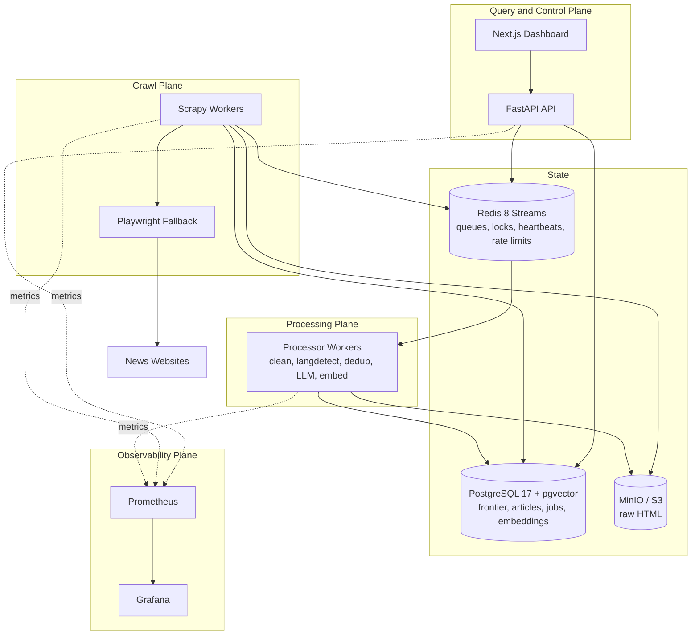

# Architecture

NewsCrawl is a distributed data acquisition and processing platform separated into five planes. No plane shares a process with another; each scales independently.

## Planes

| Plane | Component | Responsibility |
|---|---|---|
| Control | FastAPI | Create/pause/resume/cancel crawl jobs, manage sources, expose status. Never executes crawls. |
| Crawl | Scrapy workers (+ Playwright fallback) | Claim URL leases from the frontier, fetch, extract, store raw HTML, emit processing messages. |
| Processing | Redis Streams consumers | Cleaning, language detection, dedup, LLM extraction, embedding generation. |
| Query | FastAPI + pgvector | Article browsing, filtering, semantic search, analytics. |
| Observability | Prometheus, Grafana, structlog | Metrics, dashboards, structured JSON logs. |

## Monorepo layout

- `apps/api` — FastAPI app. Also owns the SQLAlchemy models, Alembic migrations, and the frontier service; the crawler and processor import these as a library (`newscrawl-api` workspace package). One schema owner, one migration history.
- `apps/crawler` — Scrapy project (`newscrawl_crawler`).
- `apps/processor` — asyncio queue consumers (`newscrawl_processor`).
- `apps/web` — Next.js dashboard.
- `packages/contracts` — Pydantic message contracts shared across planes.
- `packages/crawler-utils` — URL normalization, hashing, SimHash (pure, heavily unit-tested).
- `packages/shared-types` — TypeScript types for the web app.

Note: the spec's original layout used `app/` as each service's package name. In a uv workspace all members install into one virtualenv, so top-level package names must be unique — hence `newscrawl_api`, `newscrawl_crawler`, `newscrawl_processor`.

## Architecture decision records

### ADR-001: URL frontier in PostgreSQL, coordination in Redis

- **Problem:** the frontier must survive worker crashes, support distributed deduplication, priority scheduling, retries, and lease recovery. An in-memory set or plain Redis structures lose state or require bespoke durability work.
- **Options:** (a) Redis-only frontier (fast, but persistence/atomicity of complex scheduling logic is fragile); (b) Kafka-style log (overkill at this scale, poor random access for per-URL state); (c) PostgreSQL table with lease columns + `FOR UPDATE SKIP LOCKED` claims.
- **Chosen:** (c). `crawl_urls` holds full per-URL state; workers claim batches atomically with `SKIP LOCKED`; expired leases (`lease_expires_at < now()`) are reclaimed by a reaper. Redis handles what it is best at: per-domain politeness tokens, worker heartbeats, control signals.
- **Tradeoffs:** claim throughput is bounded by Postgres (thousands of claims/sec — far above news-crawling needs). Gained: durability, one source of truth, SQL-queryable frontier.
- **Scaling:** partial indexes on `(source_id, status, next_crawl_at)` keep claims fast; at extreme scale the table partitions by source.

### ADR-002: Redis Streams for the processing pipeline

- **Problem:** article processing (clean → dedup → LLM → embed) must be asynchronous, retry-safe, and independently scalable; the API and crawler must never block on it.
- **Options:** Celery (heavier, opaque state), RabbitMQ (extra infra), Redis Streams with consumer groups.
- **Chosen:** Redis Streams. Consumer groups give at-least-once delivery with explicit acks; pending-entry lists make crashed-consumer recovery observable; sorted sets implement delayed retries; dedicated dead-letter streams capture poison messages.
- **Tradeoffs:** at-least-once delivery requires idempotent consumers (enforced via content hashes and upserts). Redis is not the source of truth — PostgreSQL is.

### ADR-003: Two-stage fetching (HTTP first, Playwright fallback)

- **Problem:** browser rendering is 10–50x more expensive than plain HTTP; most news pages ship article content in the initial HTML.
- **Chosen:** every URL is first fetched with plain Scrapy HTTP. A page is routed to Playwright only when the source is flagged `requires_browser` or extraction finds the body missing from initial HTML. Playwright runs with shared browser contexts, resource blocking (images/fonts/media/ads), strict timeouts, and periodic browser restarts.

### ADR-004: Staged deduplication

1. URL level — unique `url_hash` over the normalized URL.
2. Exact content — SHA-256 over a normalized representation (title + author + published_at + body), immune to ad/timestamp churn in raw HTML.
3. Near-duplicate — 64-bit SimHash with Hamming-distance banding.
4. Semantic — BGE-M3 cosine similarity, computed only for SimHash candidates.

Details: [deduplication.md](deduplication.md).

### ADR-005: LLM extraction behind a provider abstraction

Gemini is the default provider; OpenAI, Anthropic, and Ollama implementations share the same interface. Responses are strict JSON validated by Pydantic; failures go through bounded retries, provider fallback, and a dead-letter queue. Token usage and cost are recorded per extraction.

### ADR-006: Self-hosted BGE-M3 embeddings with model versioning

BGE-M3 (1024-dim, MIT, strong Bangla+English) runs in the processor. Every embedding row stores `model`, `dimension`, and `version`; changing models writes new rows instead of overwriting, so re-embedding is incremental and reversible.

### ADR-007: Edge routing via central Traefik + internal Nginx

Production reuses the host's central Traefik (external `traefik_proxy` network, Cloudflare origin certs). Only the project's Nginx gateway joins that network; it routes `newscrawl.musfiqdehan.com` → web and `newscrawl-api.musfiqdehan.com` → API over the private `newscrawl_internal` network. Databases and workers are never reachable from the proxy network.
